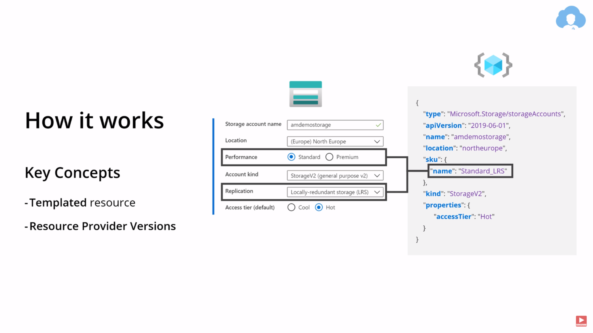

# Modèles de service cloud

# Fork: how update

```yaml
help:
  - https://stackoverflow.com/questions/7244321/how-do-i-update-or-sync-a-forked-repository-on-github
```

# Azure region
```yaml
regions: 'https://gist.github.com/ausfestivus/04e55c7d80229069bf3bc75870630ec8'
```

# REQUIREMENT

Remplacer le '.env.example' et renommez le en '.env' dans chaque dossier ouvous verrer ce fichier
ajoutez-y vos credentials azure student

```bash
email: bdx-XX@...
password: myPass
```

# Presentation: IaaS, PaaS, SaaS, CaaS et FaaS dans GCP et Azure
Le cloud computing offre une multitude de modèles de service pour répondre aux besoins variés des utilisateurs, chacun proposant un niveau d'abstraction et de gestion des ressources distinct. Explorons ces modèles et leur déclinaison dans les plateformes cloud majeures, Google Cloud Platform (GCP) et Microsoft Azure.

## IaaS (Infrastructure as a Service):

Avec IaaS, vous louez des ressources informatiques fondamentales telles que des serveurs virtuels, du stockage, du réseau et des systèmes d'exploitation. Vous bénéficiez d'un contrôle total sur ces ressources, mais devez gérer vous-même la configuration, la maintenance et la sécurité.

GCP: Compute Engine, Google Cloud Storage, Google Cloud VPC et Google Kubernetes Engine sont des exemples de services IaaS proposés par GCP.

Azure: Azure Virtual Machines, Azure Blob Storage, Azure Virtual Network et Azure Kubernetes Service sont les équivalents IaaS d'Azure.

## PaaS (Platform as a Service):

PaaS offre aux développeurs une plateforme préconfigurée pour le développement, le déploiement et l'exécution d'applications. Le PaaS s'occupe de la gestion de l'infrastructure sous-jacente, permettant aux développeurs de se concentrer sur la création d'applications.

GCP: App Engine, Google Cloud Functions et Google Kubernetes Engine (en mode PaaS) sont des exemples de services PaaS proposés par GCP.

Azure: Azure App Service, Azure Functions et Azure Kubernetes Service (en mode PaaS) sont les équivalents PaaS d'Azure.

## SaaS (Software as a Service):

SaaS offre aux utilisateurs des applications logicielles hébergées et gérées par le fournisseur de cloud. Vous accédez aux applications via un navigateur web ou une API, sans avoir à les installer ou à les gérer vous-même.

GCP: Google Workspace, G Suite, et Salesforce sont des exemples d'applications SaaS populaires exécutées sur GCP.

Azure: Microsoft 365, Dynamics 365 et Adobe Creative Cloud sont des exemples d'applications SaaS populaires exécutées sur Azure.

## CaaS (Container as a Service):

CaaS fournit aux développeurs une plateforme pour déployer et exécuter des applications conteneurisées. Les conteneurs sont des unités d'application légères et autonomes qui incluent tout le nécessaire pour s'exécuter, y compris le code, les bibliothèques et les dépendances.

GCP: Google Kubernetes Engine (en mode CaaS) et Anthos Config Management sont des exemples de services CaaS proposés par GCP.

Azure: Azure Kubernetes Service (en mode CaaS) et Azure Container Instances sont les équivalents CaaS d'Azure.

## FaaS (Function as a Service):

FaaS permet aux développeurs d'exécuter des fragments de code, ou fonctions, sans avoir à gérer l'infrastructure ou les serveurs. Vous payez uniquement pour les ressources utilisées lors de l'exécution de vos fonctions.

GCP: Google Cloud Functions est le principal service FaaS proposé par GCP.

Azure: Azure Functions est l'équivalent FaaS d'Azure.

Choisir le bon modèle de service cloud :

Le choix du modèle de service cloud approprié dépend de plusieurs facteurs, tels que les besoins spécifiques de l'utilisateur, le niveau de contrôle et de flexibilité requis, et les compétences techniques disponibles.

# Storage account



# Ressource Manager


# Plus et decouvertes

Ansible deployé des docker-compose file
https://github.com/Maissacrement/cloudprovision/blob/main/playbook.yml

Adoptez une approche Infrastructure as Code pour générer des machines virtuelles exportables sur n'importe quelle machine, éliminant ainsi l'échange de snapshots
https://github.com/Maissacrement/FreeBSDAnsible/blob/master/Vagrantfile

# ModelesDeServiceCloud
